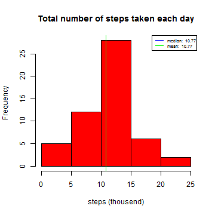

## Loading and preprocessing the data

```r
filename='activity.zip'
unzip(filename)
file=read.csv('activity.csv',header=TRUE)

Sys.setlocale("LC_TIME", "C")
```

```
## [1] "C"
```

```r
file$date=as.Date(file$date,"%Y-%m-%d")
```

## What is mean total number of steps taken per day?

```r
require(reshape2)
file_2=melt(file[,c("date","steps")],id="date", measure.vars=c("steps"),variable.name="steps")
file_2= dcast(file_2, date~ steps,sum)

vmedian= round(median(file_2$steps/1000, na.rm=TRUE), digits=2)
vmean= round(mean(file_2$steps/1000, na.rm=TRUE), digits=2)
vmedian_text=paste("median: ",vmedian)
vmean_text=paste("mean: ",vmean)

hist(file_2$steps/1000, freq=TRUE,col="red",main="Total number of steps taken each day", xlab="steps (thousend)")
abline(v=vmedian,col="blue")
abline(v=vmean,col="green")
legend("topright", cex=0.6,col=c("blue","green"), lty=c(1,1), legend=c(vmedian_text,vmean_text))
```

 

```r
dev.copy(png, file = "ASS_1_1.png",width=500 ,height=500)
```

```
## png 
##   3
```

```r
dev.off()
```

```
## png 
##   4
```
## What is the average daily activity pattern?

```r
file_3=melt(file[,c("interval","steps")],id="interval", measure.vars=c("steps"),variable.name="steps", na.rm=TRUE)
file_3= dcast(file_3, interval~ steps,mean)

file_4=melt(file[,c("interval","steps")],id="interval", measure.vars=c("steps"),variable.name="steps", na.rm=TRUE)
file_4= dcast(file_4, interval~ steps,sum)
file_4=subset(file_4,steps==max(steps))

vmaxinterval=file_4$interval
vmaxsteps=file_4$steps

vmaxinterval
```

```
## [1] 835
```

```r
vmaxsteps
```

```
## [1] 10927
```

```r
require(ggplot2)
ggplot(file_3, aes(interval, steps)) + geom_line(color="blue")+ labs(title="Steps average daily activity")+ labs(x="5-minute interval")+ labs(y="averaged across all days")+ geom_vline(xintercept = vmaxinterval,colour="red")+annotate("text", x = vmaxinterval, y = 200, label = paste("interval(",vmaxinterval, ") with maximum number of steps:",vmaxsteps),color="red")
```

 

```r
dev.copy(png, file = "ASS_1_2.png",width=500 ,height=500)
```

```
## png 
##   3
```

```r
dev.off()
```

```
## png 
##   4
```

## Imputing missing values

```r
file_5=file[!complete.cases(file),]
vRomNrMissedvalues=nrow(file_5)

file_6=merge(file, file_3, by="interval", all.x=TRUE)
file_6$steps=ifelse(is.na(file_6$steps.x),file_6$steps.y,file_6$steps.x)
file_6=file_6[,c("date","interval","steps")]

file_7=melt(file_6[,c("date","steps")],id="date", measure.vars=c("steps"),variable.name="steps")
file_7= dcast(file_7, date~ steps,sum)

vmedian_7= round(median(file_7$steps/1000), digits=2)
vmean_7= round(mean(file_7$steps/1000), digits=2)
vmedian_7_text=paste("f median: ",vmedian_7)
vmean_7_text=paste("f mean: ",vmean_7)

vmedian_7
```

```
## [1] 10.77
```

```r
vmean_7
```

```
## [1] 10.77
```

```r
par(mfrow=c(1,2), cex=0.6)
hist(file_2$steps/1000, freq=TRUE,col="red",label=TRUE, main="", xlab="")
abline(v=vmedian,col="blue")
abline(v=vmean,col="green")

hist(file_7$steps/1000, freq=TRUE,col="red4",label=TRUE, main="",xlab="",ylab="")
abline(v=vmedian_7,col="powderblue")
abline(v=vmean_7,col="palegreen")
```

 

```r
#legend("topright", cex=0.3,col=c("blue","green","powderblue","palegreen"), lty=c(1,1,1,1), legend=c(vmedian_text,vmean_text, vmedian_7_text,vmean_7_text))
dev.copy(png, file = "ASS_1_3.png",width=500 ,height=500)
```

```
## png 
##   3
```

```r
dev.off()
```

```
## png 
##   4
```

## Are there differences in activity patterns between weekdays and weekends?

```r
file_6$weekday=ifelse(weekdays(file_6$date) %in% c("Saturday", "Sunday"),"weekend","weekday")

file_8=melt(file_6[,c("interval","weekday","steps")],id=c("interval","weekday"), measure.vars=c("steps"),variable.name="steps", na.rm=TRUE)
file_8= dcast(file_8, interval+weekday~ steps,mean)

ggplot(file_8, aes(interval, steps)) +facet_grid(.~weekday)+geom_line(color="red") +labs(x="interval")+labs(y="averaged steps")
```

 

```r
dev.copy(png, file = "ASS_1_4.png",width=500 ,height=500)
```

```
## png 
##   3
```

```r
dev.off()
```

```
## png 
##   4
```

