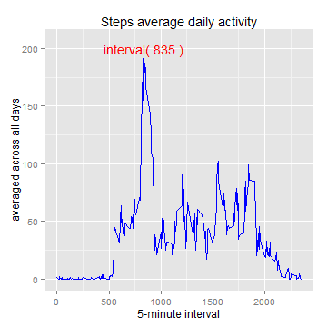

## Loading and preprocessing the data

Set the time with the functionSys.setlocale
to avoid some problems with the code.

```r
filename='activity.zip'
unzip(filename)
table=read.csv('activity.csv',header=TRUE)

Sys.setlocale("LC_TIME", "C")
```

```
## [1] "C"
```

```r
table$date=as.Date(table$date,"%Y-%m-%d")
```

## What is mean total number of steps taken per day?

```r
require(reshape2)
table_2=melt(table[,c("date","steps")],id="date", measure.vars=c("steps"),variable.name="steps")
table_2= dcast(table_2, date~ steps,sum)

vmedian= median(table_2$steps/1000, na.rm=TRUE)
vmean= mean(table_2$steps/1000, na.rm=TRUE)
vmedian_text=paste("median: ",round(vmedian, digits=2))
vmean_text=paste("mean: ",round(vmean, digits=2))
```

```r
hist(table_2$steps/1000, freq=TRUE,col="red",main="Total number of steps taken each day", xlab="steps (thousend)")
abline(v=vmedian,col="blue")
abline(v=vmean,col="green")
legend("topright", cex=0.6,col=c("blue","green"), lty=c(1,1), legend=c(vmedian_text,vmean_text))
```

 

### The mean total number of steps is 10.7661887 and the median is 10.765

## What is the average daily activity pattern?

```r
table_3=melt(table[,c("interval","steps")],id="interval", measure.vars=c("steps"),variable.name="steps", na.rm=TRUE)
table_3= dcast(table_3, interval~ steps,mean)

table_4=melt(table[,c("interval","steps")],id="interval", measure.vars=c("steps"),variable.name="steps", na.rm=TRUE)
table_4= dcast(table_4, interval~ steps,sum)
table_4=subset(table_4,steps==max(steps))

vmaxinterval=table_4$interval
vmaxsteps=table_4$steps
```


```r
require(ggplot2)
ggplot(table_3, aes(interval, steps)) + geom_line(color="blue")+ labs(title="Steps average daily activity")+ labs(x="5-minute interval")+ labs(y="averaged across all days")+ geom_vline(xintercept = vmaxinterval, colour="red")+ annotate("text", x = vmaxinterval, y = 200, label = paste("interval(",vmaxinterval,")"), color="red")
```

 
### The interval 835 has the maximun steps: 10927

## Imputing missing values
to complete the missed values I merge the original table
with the table_3, which containt the interval with the main.
And I replace the NA value with the main depend from the interval

```r
table_5=table[!complete.cases(table),]
vRomNrMissedvalues=nrow(table_5)

table_6=merge(table, table_3, by="interval", all.x=TRUE)
table_6$steps=ifelse(is.na(table_6$steps.x),table_6$steps.y,table_6$steps.x)
table_6=table_6[,c("date","interval","steps")]

table_7=melt(table_6[,c("date","steps")],id="date", measure.vars=c("steps"),variable.name="steps")
table_7= dcast(table_7, date~ steps,sum)

vmedian_7= median(table_7$steps/1000)
vmean_7= mean(table_7$steps/1000)
vmedian_7_text=paste("f median: ",round(vmedian_7,digits=2))
vmean_7_text=paste("f mean: ",round(vmean_7,digits=2))
```


```r
par(mfrow=c(1,2), cex=0.6)
hist(table_2$steps/1000, freq=TRUE,col="red",label=TRUE, main=NULL, xlab="steps (thousend)")
hist(table_7$steps/1000, freq=TRUE,col="red4",label=TRUE,main=NULL, xlab="steps (thousend)")
title(main="Total number of steps taken each day/datas with NA values & datas without NA values", adj=1,outer=TRUE)
```

 
### the right histogramm (with the filled values) has more frequencies as the left (with the NA values)

### After filled the missed values the new mean total number of steps is 10.7661887 and the new median is 10.7661887. the mean is equal the median

### before the mean was greater than the median (10.7661887 > 10.765)

## Are there differences in activity patterns between weekdays and weekends?

```r
table_6$weekday=ifelse(weekdays(table_6$date) %in% c("Saturday", "Sunday"),"weekend","weekday")

table_8=melt(table_6[,c("interval","weekday","steps")],id=c("interval","weekday"), measure.vars=c("steps"),variable.name="steps", na.rm=TRUE)
table_8= dcast(table_8, interval+weekday~ steps,mean)
```

```r
ggplot(table_8, aes(interval, steps)) +facet_grid(.~weekday)+geom_line(color="red") +labs(x="interval")+labs(y="averaged steps")
```

 
### The last plot show that, there are differences in activity patterns between weekdays and weekends. The maximun steps is reached in the weekdays
